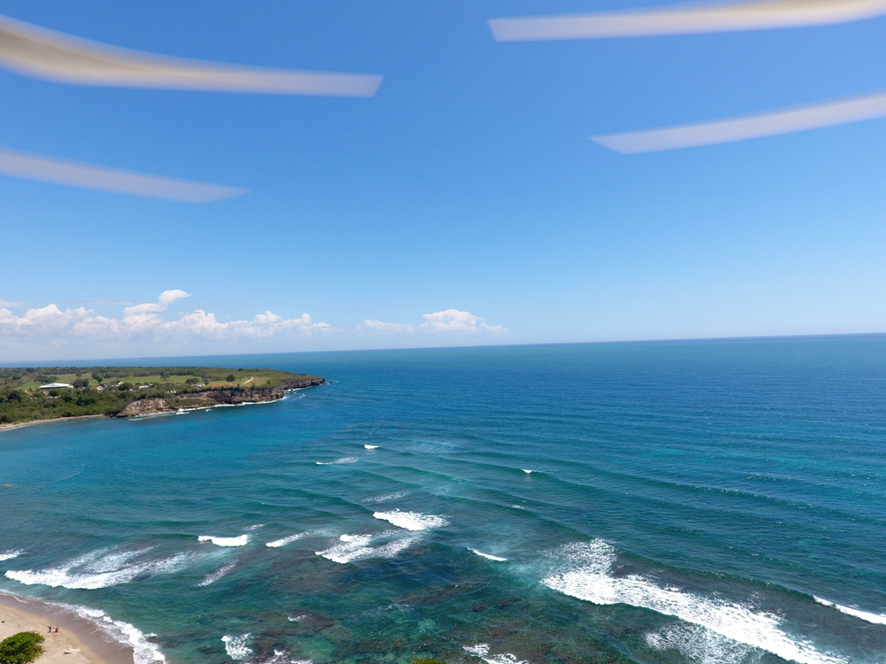

# Material de apoyo de la asignatura "Geomorfología", Licenciatura en Geografía, Universidad Autónoma de Santo Domingo (UASD)

* [Programa](programa-geomorfologia.md)

* [Asignaciones prácticas](practicas/README.md)

* [Asignación "Manuscrito""](practicas/practica-99-tu-manuscrito.md)

* Diapositivas

    * [Tema 1. Epistemología, conceptos, bases geológicas, introducción a los procesos de la superficie terrestre](https://geomorfologia-master.github.io/tema-1-epistemologia-geologia-intro-procesos/)

    * [Tema 2. Tiempo en geomorfología](https://drive.google.com/file/d/1I7kNCS3oj5NpXsinVGaIZAezsZCAyRqI/view?usp=sharing)

    * [Tema 3. Meteorización y formas resultantes](https://github.com/geomorfologia-master/tema-3-meteorizacion-y-formas-resultantes/blob/gh-pages/meteorizacion_y_formas_resultantes.pdf)

    * [Tema 4. Procesos fluviales](https://drive.google.com/open?id=1e-BTzT56c6F7JWwSAXlb3UG8JWu2FxtV)

    * [Tema 5. Procesos de laderas y movimientos en masa](https://drive.google.com/open?id=1_ATalYovOxaODoroXCdZuTGUHOhrBdT-)
   
    * [Tema 6. Procesos litorales](https://drive.google.com/open?id=1r5t2fsSGDA8w4dtgkDN4eMylnvc9NXWw)
    
    * [Tema 7. Geomorfología kárstica](https://drive.google.com/open?id=1D4AF8yKdV9aunDzrSBXyC138mmN6xOIY)
    
