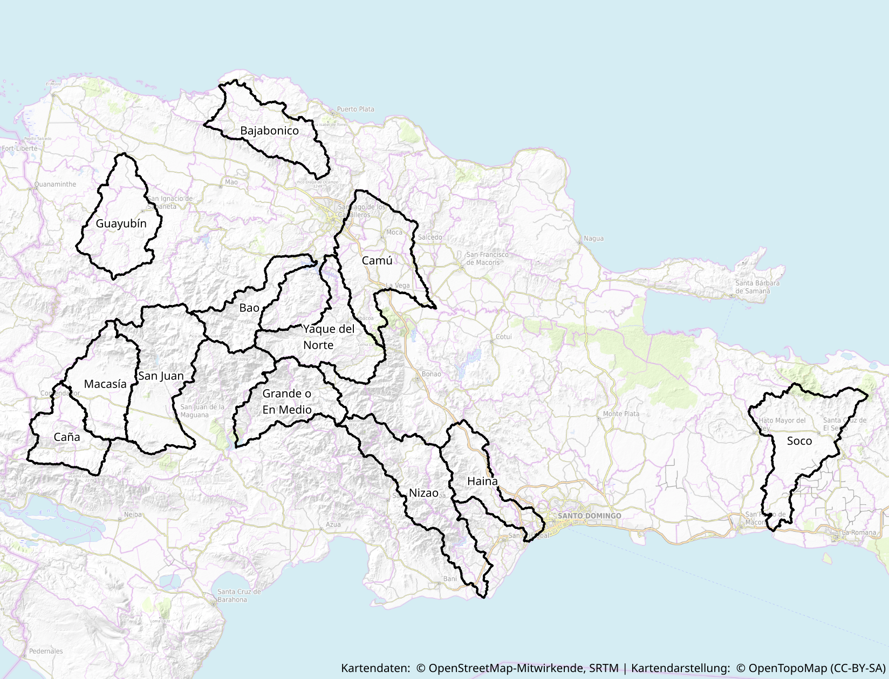

Guía para la redacción de tu manuscrito   Asignatura Geomorfología
(GEO-1140)
================
José Ramón Martínez Batlle

## El “ecosistema” de servicios que usarás durante la asignatura

-   R+RStudio+GRASS GIS. Imprescindible. Dispondrás de una cuenta
    temporalmente en mi servidor que ya ofrece estos paquetes de
    software a través del navegador. No obstante, puedes prescindir de
    mi servidor si instalas R+RStudio+GRASS GIS en tu PC.

-   Foro. Opcional, aunque imprescindible para resolver dudas. Se trata
    de un servidor Mattermost, parecido a Slack, pero de código abierto.
    Envía tus preguntas por esa vía.

-   GitHub. Necesitarás una cuenta de GitHub y un token para crear tu
    manuscrito y hacerle modificaciones. Más adelante te explico.

-   Vídeos tutoriales en YouTube y código fuente de ejemplo. Los vídeos
    tutoriales se encuentran alojados en la lista de reproducción
    [“Asignatura
    Geomorfología”](https://www.youtube.com/watch?v=9F7BIAUNvRY&list=PLDcT2n8UzsCSt1-NnUQ8anwHhmouFr0Kv).
    Consulta detalles sobre la lista y su contenido en [este
    resumen](https://github.com/geomorfologia-202102/material-de-apoyo/blob/master/README.md).

## Prepara el “terreno” para tu manuscrito

### Realiza tutorial introductorio

Realiza el [tutorial “Introducción a
R”](https://geofis.shinyapps.io/tutorial1/). Se trata de una breve
introduccion interactiva y autoguiada en la que conocerás los
principales objetos de R. Además, este tutorial te muestra trucos sobre
cómo enfrentarte a la programación en R, por lo que **es muy importante
que lo realices y practiques**.

### Regístrate en GitHub y crea un token

Tal como te comenté, necesitarás una cuenta de GitHub. Para crearla, ve
a [github.com](https://github.com/), botón *Sign up* y sigue las
indicaciones correspondientes. Una vez tengas tu cuenta de GitHub,
podrás crear repositorios. Tu manuscrito se alojará en un repositorio de
GitHub, concretamente, en la organización creada al efecto para esta
asignatura, y esta es la razón por la que necesitas una cuenta en dicho
servicio. **No olvides notificarme tu usuario de GitHub tan pronto lo
tengas, para invitarte a la organización de la asignatura. Luego de que
te envíe la invitación, te llegará un mensaje de correo con una
invitación que debes aceptar para formar parte de la organización. Es
importante que completes el dicho proceso, porque de lo contrario, NO
podrás realizar las asignaciones.**

Tu cuenta de GH, por sí sola, no te permite hacer modificaciones de tu
manuscrito desde el “repo local” (que alojarás en el servidor de
RStudio) al repo remoto (en GitHub). Es decir, con usuario y password no
podrás empujar cambios al repo remoto (proceso que en terminología git
se conoce como *push*), para lo cual necesitarás un token. Créalo en
este momento, y resérvalo para uso posterior, siguiendo estos pasos
([también tienes esta guía
ilustrada)](https://docs.github.com/es/github/authenticating-to-github/keeping-your-account-and-data-secure/creating-a-personal-access-token).

1.  Inicia sesión con tu cuenta en [github.com](https://github.com/)

2.  Ve a *Settings* =&gt; *Developer Settings* =&gt; *Personal Access
    Token* =&gt; *Generate New Token* (probablemente pida tu clave de
    GitHub)

3.  Rellena el formulario.

    -   En *Note* escribe un nombre para el token. Por ejemplo,
        “Semestre 202102”

    -   En *Expiration* elige *Custom* y ponle una fecha posterior al
        término del semestre.

    -   Activa los permisos del grupo *repo*, tal como se muestra aquí:

    

4.  Finalmente presiona *Generate token*. Tu token será una cadena de
    caracteres parecida a esta: “*ghp\_Gsgxfd…*”

5.  **¡IMPORTANTE! Copia el token a un archivo de texto o a un mensaje
    de correo; GH no te lo mostrará nuevamente**.

### Crea tu repositorio remoto para el manuscrito en GitHub

1.  Asegúrate de haber iniciado en tu cuenta de GitHub. Si estás usando
    una PC compartida, y otro usuario tuviese una cuenta de GitHub
    iniciada, el manuscrito se creará con dicha cuenta. Por tal razón,
    asegúrate previamente de que tu cuenta de GH la que esté iniciada.

2.  Haz clic en la URL de la asignación (Classroom de GitHub):
    <https://classroom.github.com/a/IPHYG5uI>

3.  Al hacer clic sobre la URL, te preguntará si aceptas la asignación
    del Classroom de GitHub. Presiona el botón *Accept this assignment*.

4.  Tras presionar el botón, se creará una copia remota vacía (un
    “esqueleto”) del repositorio de manuscrito, a partir de una
    plantilla, en la organización
    [geomorfologia-202102](https://github.com/geomorfologia-202102).
    Puedes consultarlo visitando la organización y presionando sobre el
    nombre de tu repo, que será algo tal que
    `unidad-0-asignacion-99-mi-manuscrito-TUNOMBREDEUSUARIOENGITHUB`.

### Crea una copia local de tu repo de manuscrito en mi servidor RStudio

Si ya tienes tu repo remoto de manuscrito, podrás hacer una copia local
en mi servidor RStudio; a este proceso se le denomina “clonar” en
terminología git. En dicha copia local alojarás tus ediciones que luego
sincronizarás con GitHub. Para clonar localmente tu repo, necesitarás el
token que creaste en pasos anteriores, así que tenlo a mano. Pasos para
crear tu copia local:

-   Sigue [este tutorial HASTA el minuto
    5:10](https://www.youtube.com/watch?v=v1EX8OzAyBw).

> Nota 1. En el minuto 3:42 verás que GitHub solicita clave. En ese paso
> necesitarás el token que recién creaste.

> Nota 2. Para acceder al servidor de RStudio, utiliza la URL, usuario y
> clave enviada a tu correo electrónico.

> Nota 3. Sigue las indicaciones que facilitaré en las sesiones de clase
> y en el foro de la asignatura, y pide ayuda siempre que la necesites.

### Recapitulando

Antes de comenzar a redactar tu manuscrito, repasa la siguiente lista de
control:

1.  Tienes cuenta de GitHub y token. También verifica que formas parte
    de la organización de la asignatura, porque de lo contrario, no
    podrás realizar asignaciones.

2.  Creaste una copia remota del repositorio de manuscrito al aceptar la
    asignación del Classroom de GitHub.

3.  Creaste una copia local de tu repo de manuscrito en mi servidor
    RStudio. Para ello, verifica que dispones de credenciales acceso al
    servidor. Si no las tienes, escríbeme para resolverlo.

4.  Realizaste el
    [tutorial-introduccion-a-r](https://geofis.shinyapps.io/tutorial1/).

Si cumples con todo lo anterior, pasa al siguiente apartado. De lo
contrario, vuelve atrás y completa lo que te falte.

## Redacta tu manuscrito

### Cuencas asignadas

Tienes una cuenca asignada; localiza la tuya en la siguiente lista así
como los archivos correspondientes (cada archivo contiene íntegramente
la cuenca asignada, más un área buffer de 1 km):

| Estudiante                   | Nombre de cuenca asignada | Archivo TIF DEM (carpeta `datos-fuente` de tu repo) |
|:-----------------------------|:--------------------------|:----------------------------------------------------|
| Daniel Beltrés Plasencio     | Grande o En Medio         | srtm\_dem\_cuenca\_grande\_o\_en\_medio.tif         |
| Edward Palmero Morel         | Nizao                     | srtm\_dem\_cuenca\_nizao.tif                        |
| Frank F. De la Cruz Diaz     | Macasía                   | srtm\_dem\_cuenca\_macasia.tif                      |
| Franklyn Gomez Espinal       | Bao                       | srtm\_dem\_cuenca\_bao.tif                          |
| Isaac de la Rosa Caraballo   | Soco                      | srtm\_dem\_cuenca\_soco.tif                         |
| Jennifer Núñez Montero       | Yaque del Norte           | srtm\_dem\_cuenca\_yaque\_del\_norte.tif            |
| Joel Benjamín Pérez García   | Camú                      | srtm\_dem\_cuenca\_camu.tif                         |
| Rafael Martin Berroa Rosario | Bajabonico                | srtm\_dem\_cuenca\_bajabonico.tif                   |
| Romanti Esther Aquino Payano | Haina                     | srtm\_dem\_cuenca\_haina.tif                        |
| Saderis Carmona Marte        | San Juan                  | srtm\_dem\_cuenca\_san\_juan.tif                    |

### Preguntas de investigación, organizadas por temas

En tu manuscrito, podrás responder las preguntas de investigación
transcritas abajo a partir de análisis morfométricos. Para cada
pregunta, te ofrezco recursos teóricos específicos. Igualmente, para
cada una, o para grupos de preguntas, te servirá redactar una hipótesis
de partida. Considera una hipótesis como una posible respuesta a cada
pregunta. No te esfuerces en formular “la hipótesis correcta”; formula
una posible respuesta a cada pregunta de acuerdo a lo que entiendas
lógico.

En la introducción de tu manuscrito, dejarás plasmadas las preguntas y
las hipótesis que formules, PERO con tus propias palabras. **No está
permitido copiar/pegar texto de este documento, ni de ningún otro, en tu
manuscrito**. Encontrarás detalles sobre cómo redactar las secciones de
tu manuscrito más adelante.

En esta guía te incluí referencias para que puedas acceder a una lista
recursos, específicamente mapas y tutoriales que te resultarán útiles.

El manuscrito me lo entregarás casi al finalizar el semestre. La fecha
específica la verás en el calendario de la próxima sección.

#### Aspecto general de la cuenca y de la red

-   ¿Qué rango de umbral de acumulación de flujo para algoritmos de
    extracción de redes de drenaje se ajusta mejor a la red del mapa
    topográfico nacional? Para conocer sobre umbral de acumulación,
    consulta este
    [vídeo](https://www.youtube.com/watch?v=gPDf6w3NOgs&list=PLDcT2n8UzsCSt1-NnUQ8anwHhmouFr0Kv&index=8)
    y este otro
    [vídeo](https://www.youtube.com/watch?v=17MRQTJ4gUU&list=PLDcT2n8UzsCSt1-NnUQ8anwHhmouFr0Kv&index=10).
    Mira también [este
    tweet](https://twitter.com/geografiard/status/1125103496645181440).

-   ¿Qué forma tiene la red de drenaje de mi cuenca? ¿De qué depende?
    ¿Control estructural? ¿Control climático? Consultar distintas formas
    en [De Pedraza Gilsanz et
    al.](https://drive.google.com/file/d/1fVepLvEmlUG4mIFJxd8A6ftewPYvuHlO/view?usp=sharing)
    página 250, o en [Gutiérrez
    Elorza](https://drive.google.com/file/d/1OyIdJkIOZakgPsZx7Wzu_IqlkCoZtB_2/view?usp=sharing)
    página 282

-   ¿Qué forma tiene mi cuenca? Consultar la página 202 de [Pedraza et
    al](https://drive.google.com/file/d/1fVepLvEmlUG4mIFJxd8A6ftewPYvuHlO/view?usp=sharing)
    y [esta
    imagen](http://www.netmaptools.org/Pages/NetMapHelp/drex_tributary_confluence_effects_custom_7.png)
    perteneciente a [este
    trabajo](http://www.netmaptools.org/Pages/NetMapHelp/tributary_confluence_effects.htm).
    Notarás que el hidrograma de crecida depende mucho de la forma de la
    cuenca

-   Tras analizar la forma de mi cuenca me preguntaré, ¿hay evidencia
    preliminar/visual para sobre un posible fenómeno de reorganización
    de drenaje (e.g. captura fluvial)? Si la hubiere, formula una
    hipótesis para explicar dicho fenómeno. Para aprender más sobre
    reorganización de drenaje, te servirá este
    [vídeo](https://youtu.be/bDYN2yP4yEY?list=PLDcT2n8UzsCSt1-NnUQ8anwHhmouFr0Kv&t=1726).
    Igualmente, consultar la página 291 de [Gutiérrez
    Elorza](https://drive.google.com/file/d/1OyIdJkIOZakgPsZx7Wzu_IqlkCoZtB_2/view?usp=sharing),
    así como [este
    artículo](https://drive.google.com/file/d/1iwnXJ33VMEgmrWQD5Ztbn5dpko2lJA-L/view?usp=sharing)
    de Bishop. Busca también materiales didácticos y cualquier otro
    recurso sobre reorganización de drenaje ren la web; el subtipo más
    conocido es la captura fluvial, así que te recomiendo buscar por
    dicha palabra clave, o por su equivalente en inglés, *stream piracy*
    o *river piracy*.

#### Orden de red y análisis hortoniano

-   ¿Existe algún patrón destacable en la forma de la cuencas según su
    orden? Y respecto de las formas de las redes de drenaje según
    órdenes, ¿existe un algún patrón? En cualquier caso, sea forma de
    cuenca o de red, si existiese algún patrón destacable por órdenes,
    ¿de qué depende?. Consultar páginas 144 y siguientes de [este
    extracto del libro de
    Ritter](https://drive.google.com/file/d/1GwAfwEtRtRGcrUJsNezwz_wypDnS-WML/view?usp=sharing).

-   Tras analizar la forma de las cuencas de cada orden, ¿hay evidencia
    preliminar/visual para sobre un posible fenómeno de reorganización
    de drenaje (e.g. captura fluvial? Te resultarán útiles las mismas
    referencias de la pregunta sobre reorganización del drenaje del tema
    anterior.

-   ¿Es constante la razón de bifurcación entre órdenes de mi cuenca?
    ¿Difiere la razón de bifurcación calculada por medio de coeficientes
    de regresión de la generada por el promedio de las razones de
    bifurcación de cada par de órdenes de red? Si existen diferencias
    muy grandes, ¿a qué se deben? [Este
    vídeo](https://www.youtube.com/watch?v=JO-25I2yj2I&list=PLDcT2n8UzsCSt1-NnUQ8anwHhmouFr0Kv&index=11)
    así como [este
    otro](https://www.youtube.com/watch?v=vzEBBhedypE&list=PLDcT2n8UzsCSt1-NnUQ8anwHhmouFr0Kv&index=12),
    podrían ser de utilidad para responder estas preguntas. Hay
    materiales en la web sobre razón de bifurcación.

#### Perfiles longitudinales e índice de concavidad de cursos más largos

-   Normalmente, los perfiles longitudinales y los índices de concavidad
    de los cursos más largos de una cuenca, presentan correspondencia
    espacial con la litología. ¿Ocurre esto en mi cuenca? Consulta la
    página 291 de [Gutiérrez
    Elorza](https://drive.google.com/file/d/1OyIdJkIOZakgPsZx7Wzu_IqlkCoZtB_2/view?usp=sharing)
    y el trabajo de [Snow y
    Slingerland](https://drive.google.com/file/d/1ON3OZGTOJ4rAX_L4MIsS_3VU_ZZEoWTQ/view?usp=sharing)

-   ¿Hay evidencia de uno o varios fenómenos de reorganización del
    drenaje a partir del análisis de los perfiles longitudinales y los
    índices de concavidad? Como contenido teórico sobre este tema, valen
    las mismas referencias sobre reorganización citadas en preguntas
    anteriores.

#### Morfometría de cuenca

-   De los parámetros morfométricos, ¿cuáles se asocian con las
    características litológicas y estructurales de mi cuenca? Ver [este
    artículo](http://www.ccsenet.org/journal/index.php/jgg/article/view/0/39703)

-   La integral y curva hipsométricas de mi cuenca, ¿con cuáles factores
    se asocian? Profundizar con la misma referencia anterior.

### Recursos

#### Vídeos tutoriales

-   [Vídeo 1. Cómo hacer *commit&gt;push* de cambios a un repo remoto
    desde un repo local en el servidor RStudio (DESDE el minuto
    5:10)](https://www.youtube.com/watch?v=v1EX8OzAyBw). En párrafos
    anteriores te pedí que practicaras éste vídeo para clonar tu repo
    localmente en el servidor RStudio. Ahora te pido que continúes desde
    el minuto 5:10, para que hagas *commit&gt;push*, que es el proceso
    mediante el cual, tus cambios locales (en el servidor RStudio) se
    “sincronizan” con los del repo remoto (en GitHub). En el vídeo
    muestro cómo subir unos cambios sencillos (e hipotéticos) realizados
    al archivo `manuscrito.Rmd`.

> El archivo `manuscrito.Rmd` es el que contendrá toda tu redacción, y
> desde allí podrás generar tu salida en formato PDF.

Los comandos a ejecutar, mencionados en el vídeo, son los siguientes
(cambia por tu correo electrónico registrado en GitHub y tu usuario de
GitHub):

    git config --global user.email "you@example.com"
    git config --global user.name "Your Name"

En el minuto 11:54 verás que GitHub pide clave. En tu caso, deberás
colocar el token que generaste en pasos anteriores.

-   [Vídeo 2. Cómo insertar referencias, figuras,
    tablas](https://www.youtube.com/watch?v=5PARNk6QTgY). Este vídeo
    explica cómo insertar referencias bibliográficas usando entradas
    BibTeX, cómo insertar figuras a partir de archivos de imágenes, y
    cómo insertar tablas de Markdown.

A continuación, 11 vídeos tutoriales del canal de YouTube pelempito1,
esenciales para desarrollar tu manuscrito, que tratan sobre análisis
morfométrico con GRASS GIS desde R usando como modelo la cuenca del
arroyo Pantuflas (Constanza).

Los vídeos se asocian con *scripts* de R y GRASS GIS que usarás como
fuente, y se encuentran en el repo [Geomorfología. Asignaciones del tema
4: procesos
fluviales](https://github.com/geomorfologia-master/unidad-4-asignacion-1-procesos-fluviales).
No es necesario clonar dicho repo (en los tutoriales se explica cómo
usarlo), es preferible visualizarlo desde GitHub, como verás en los
vídeos tutoriales en cada caso. Si quieres clonarlo para reproducirlo,
perfecto, pero te recomiendo que uses el repo únicamente como fuente
para tus propios *scripts*.

Notarás que todos los vídeos comienzan de la misma forma: muestro el
repo, me concentro en un tema, el cual desarrollo ejecutando código
desde un archivo. Tú harás exactamente lo mismo: tomarás código desde
dicho repo (sin clonarlo) Y (muy importante) lo adaptarás a tu caso
particular.

> En el [Vídeo complementario 1 (C1). “Tips para construir un script
> reproducible con todos los análisis
> morfométricos”](https://www.youtube.com/watch?v=Y3_pgx9eq5w&list=PLDcT2n8UzsCSt1-NnUQ8anwHhmouFr0Kv&index=16),
> te muestro cómo usar un script fuente y reproducirlo adaptándolo a tu
> cuenca.

> Al hacer tus mapas, aprovecha las ventajas que te ofrece el paquete
> `leaflet` de R. Puedes hacer tus mapas también con QGIS. Ddescarga tu
> base de datos de GRASS GIS y ábrela en QGIS para hacer composiciones
> de mapas a tu conveniencia. El [Vídeo C2. “Descargar base de datos de
> GRASS GIS desde servidor RStudio para crear mapas en
> QGIS”](https://www.youtube.com/watch?v=7kSjRB68sMs&list=PLDcT2n8UzsCSt1-NnUQ8anwHhmouFr0Kv&index=17),
> te explica cómo hacerlo.

-   [Vídeo 3. GRASS GIS desde R: introducción a GRASS GIS, R y al
    paquete
    rgrass7](https://www.youtube.com/watch?v=cORbTaa827g&list=PLDcT2n8UzsCSt1-NnUQ8anwHhmouFr0Kv&index=5)

-   [Vídeo 4. GRASS GIS desde R: proyección, extensión y resolución de
    región, importar mapa, addons,
    ayuda](https://www.youtube.com/watch?v=YkqHMeko8-Y&list=PLDcT2n8UzsCSt1-NnUQ8anwHhmouFr0Kv&index=6)

-   [Vídeo 5. GRASS GIS desde R: Explorar datos espaciales
    básicos](https://www.youtube.com/watch?v=w5lGrm_XKek&list=PLDcT2n8UzsCSt1-NnUQ8anwHhmouFr0Kv&index=7)

-   [Vídeo 6. GRASS GIS desde R: Explorar datos espaciales básicos:
    calcular parámetros, representar con
    lealfet](https://www.youtube.com/watch?v=gPDf6w3NOgs&list=PLDcT2n8UzsCSt1-NnUQ8anwHhmouFr0Kv&index=8)

-   [Vídeo 7. GRASS GIS desde R: Extraer una cuenca con r.water.outlet.
    Visualizar con mapview y
    leaflet](https://www.youtube.com/watch?v=acU2dj23DlM&list=PLDcT2n8UzsCSt1-NnUQ8anwHhmouFr0Kv&index=9)

-   [Vídeo 8. GRASS GIS desde R: Extraer una red drenaje con
    r.stream.extract. Visualizar con
    leaflet](https://www.youtube.com/watch?v=17MRQTJ4gUU&list=PLDcT2n8UzsCSt1-NnUQ8anwHhmouFr0Kv&index=10)

-   [Vídeo 9. GRASS GIS desde R: Orden de red y razón de bifurcación
    explicados
    (teoría)](https://www.youtube.com/watch?v=vzEBBhedypE&list=PLDcT2n8UzsCSt1-NnUQ8anwHhmouFr0Kv&index=12)

-   [Vídeo 10. GRASS GIS desde R: Orden de red y análisis hortoniano
    usando r.stream\*. Visualizar con
    leaflet](https://www.youtube.com/watch?v=JO-25I2yj2I&list=PLDcT2n8UzsCSt1-NnUQ8anwHhmouFr0Kv&index=11)

-   [Vídeo 11. GRASS GIS desde R: Crear perfiles longitudinales y
    calcular índices de
    concavidad](https://www.youtube.com/watch?v=wkkNKBSh4lQ&list=PLDcT2n8UzsCSt1-NnUQ8anwHhmouFr0Kv&index=13)

-   [Vídeo 12. GRASS GIS desde R: Parámetros de cuenca con
    r.basin](https://www.youtube.com/watch?v=n17NcoCGfak&list=PLDcT2n8UzsCSt1-NnUQ8anwHhmouFr0Kv&index=14)

-   [Vídeo 13. GRASS GIS desde R: Curva e integral
    hipsométrica](https://www.youtube.com/watch?v=kLDUq9W15lk&list=PLDcT2n8UzsCSt1-NnUQ8anwHhmouFr0Kv&index=15)

#### Mapas disponibles

-   Geológico escala 1:250,000:
    -   [Formato KMZ para
        GoogleEarth](https://drive.google.com/file/d/1iLYmhiFq2cowuelKqAsI506Z2AYhBxFJ/view?usp=sharing)
    -   [Formato TIFF
        (QGIS)](https://drive.google.com/file/d/1NKyZjxzIedFq6Lq0bx-2YrGq5PtMh_r7/view?usp=sharing)
    -   [Lizmap
        Server](https://geofis.xyz/lm/index.php/view/map/?repository=geo250krd&project=geologico_gpkg)
    -   [URL del
        WMS](https://geofis.xyz/lm/index.php/lizmap/service/?repository=geo250krd&project=geologico_gpkg&SERVICE=WMS&VERSION=1.3.0&REQUEST=GetCapabilities).
        La URL la puedes añadir a QGIS como un servicio WMS.
-   Mapa topográfico nacional escala 1:50,000 en servidor Lizmap. En
    ambos casos, tanto consultando vía el navegador, como usando el
    servicio WMS en QGIS, **necesitarás acercarte a una escala 1:100,000
    o más detallada (e.g. 1:50,000). No es visible a escalas inferiores
    a 1:100,000 (e.g. no podrás verlo a 1:110,000)**:
    -   [Lizmap
        Server](https://geofis.xyz/lm/index.php/view/map/?repository=mtnrd50k&project=mtnrd50k).
    -   [URL del
        WMS](https://geofis.xyz/lm/index.php/lizmap/service/?repository=mtnrd50k&project=mtnrd50k&VERSION=1.3.0).
        La URL la puedes añadir a QGIS como un servicio WMS.

**Pregúntame cómo añadir una fuente WMS en QGIS. ¡¡Te será de gran
ayuda!!**

### Calendario de entregas

| Ítem                                | ¿Qué entregas?                                                                                                                                                       | 20/sept/2021                                        | 27/sept/2021                                                                                                                                                                                               | 4/oct/2021                                                                                                                                                                                                                                                                                                                                                                                                                                                                                                         | 18/oct/2021                                                                                                                                                                                                                                                                                                                                                                                                                                                                                                            | 1/nov/2021                                                                                               | 15/nov/2021                                                                                                                                                                                                    | 29/nov/2021                                            | 29/nov/2021-13/dic/2021                     | 20/dic/2021                                                        |
|-------------------------------------|----------------------------------------------------------------------------------------------------------------------------------------------------------------------|-----------------------------------------------------|------------------------------------------------------------------------------------------------------------------------------------------------------------------------------------------------------------|--------------------------------------------------------------------------------------------------------------------------------------------------------------------------------------------------------------------------------------------------------------------------------------------------------------------------------------------------------------------------------------------------------------------------------------------------------------------------------------------------------------------|------------------------------------------------------------------------------------------------------------------------------------------------------------------------------------------------------------------------------------------------------------------------------------------------------------------------------------------------------------------------------------------------------------------------------------------------------------------------------------------------------------------------|----------------------------------------------------------------------------------------------------------|----------------------------------------------------------------------------------------------------------------------------------------------------------------------------------------------------------------|--------------------------------------------------------|---------------------------------------------|--------------------------------------------------------------------|
| Manuscrito                          | **Secciones de tu manuscrito**, incorporando análisis realizados con lo que aprendas en los tutoriales y en sesiones de seguimiento                                  |                                                     |  Editado encabezado YAML, excepto `abstract`. Iniciada la introducción                                                                                                                                     | Sección Introducción completada                                                                                                                                                                                                                                                                                                                                                                                                                                                                                    | Sección Metodología completada                                                                                                                                                                                                                                                                                                                                                                                                                                                                                         | Avances sobre sección Resultados                                                                         | Sección Resultados completada                                                                                                                                                                                  | Discusión completada y Resumen. Manuscrito finalizado. | Recibes mi retroalimentación sobre tu texto | Atendido cada punto señalado por mí. Presentación de diapositivas. |
| Tutoriales visualizados y adaptados | 1\) **Pruebas** de que comprendes los tutoriales y/o 2) **Script reproducible aplicado** a tu cuenca; 3) Tu **manuscrito refleja** lo aprendido en dichos tutoriales | [tutorial1](https://geofis.shinyapps.io/tutorial1/) | Vídeos [1](https://www.youtube.com/watch?v=v1EX8OzAyBw&list=PLDcT2n8UzsCRDqjqSeqHI1wsiNOqpYmsJ&index=1) y [2](https://www.youtube.com/watch?v=5PARNk6QTgY&list=PLDcT2n8UzsCRDqjqSeqHI1wsiNOqpYmsJ&index=2) | Vídeos [3](https://www.youtube.com/watch?v=cORbTaa827g&list=PLDcT2n8UzsCSt1-NnUQ8anwHhmouFr0Kv&index=5), [4](https://www.youtube.com/watch?v=YkqHMeko8-Y&list=PLDcT2n8UzsCSt1-NnUQ8anwHhmouFr0Kv&index=6), [5](https://www.youtube.com/watch?v=w5lGrm_XKek&list=PLDcT2n8UzsCSt1-NnUQ8anwHhmouFr0Kv&index=7), [6](https://www.youtube.com/watch?v=gPDf6w3NOgs&list=PLDcT2n8UzsCSt1-NnUQ8anwHhmouFr0Kv&index=8) y [C1](https://www.youtube.com/watch?v=Y3_pgx9eq5w&list=PLDcT2n8UzsCSt1-NnUQ8anwHhmouFr0Kv&index=16) | Vídeos [7](https://www.youtube.com/watch?v=acU2dj23DlM&list=PLDcT2n8UzsCSt1-NnUQ8anwHhmouFr0Kv&index=9), [8](https://www.youtube.com/watch?v=17MRQTJ4gUU&list=PLDcT2n8UzsCSt1-NnUQ8anwHhmouFr0Kv&index=10), [9](https://www.youtube.com/watch?v=vzEBBhedypE&list=PLDcT2n8UzsCSt1-NnUQ8anwHhmouFr0Kv&index=12), [10](https://www.youtube.com/watch?v=JO-25I2yj2I&list=PLDcT2n8UzsCSt1-NnUQ8anwHhmouFr0Kv&index=11) y [C2](https://www.youtube.com/watch?v=7kSjRB68sMs&list=PLDcT2n8UzsCSt1-NnUQ8anwHhmouFr0Kv&index=17) | Vídeo [11](https://www.youtube.com/watch?v=wkkNKBSh4lQ&list=PLDcT2n8UzsCSt1-NnUQ8anwHhmouFr0Kv&index=13) | Vídeos [12](https://www.youtube.com/watch?v=n17NcoCGfak&list=PLDcT2n8UzsCSt1-NnUQ8anwHhmouFr0Kv&index=14) y [13](https://www.youtube.com/watch?v=kLDUq9W15lk&list=PLDcT2n8UzsCSt1-NnUQ8anwHhmouFr0Kv&index=15) |                                                        |                                             |                                                                    |

### Tips de redacción

Por experiencia, sé que de nada valdría impartir un curso sobre cómo
escribir un manuscrito. A escribir se aprende escribiendo (redunda sí,
pero es así). Por ello, en este mensaje verás cuestiones básicas, pero
también aportaré referencias complementarias con las que podrás
profundizar.

En tu manuscrito, deberás responder las preguntas de investigación sobre
morfometría fluvial que ya habrás leído. No se trata de un examen en el
que rellenas “preguntas de desarrollo”; se trata de escribir un
manuscrito con todas las secciones que tiene el “esqueleto” facilitado
por mí (e.g. Resumen, Introducción, Metodología, Resultados, Discusión,
etc.), siguiendo las [normas del Anuario de Investigaciones Científicas
de la
UASD](docs/instrucciones-para-autores-anuario-investigaciones-cientificas-UASD.pdf).
Cuentas con la plantilla del manuscrito—y que se encuentra en tu repo de
manuscrito—que satisface bastante bien los requisitos del Anuario, así
que al menos en cuanto a la forma no tendrás que preocuparte mucho.

Como norma general, **nunca copies y pegues texto, puesto que es plagio
y lo penalizo con la reprobación de la asignatura. Si necesitas citar a
un/a autor/a, usa tus propias palabras, pero nunca transcribas texto
hacia tu manuscrito** (hay contadas excepciones a esta regla, pero
ninguna aplica en tu caso).

Recuerda que, para cada pregunta de investigación, te servirá redactar
una hipótesis de partida. Considera una hipótesis como una posible
respuesta a cada pregunta. No te esfuerces en formular “la hipótesis
correcta”; formula una posible respuesta a cada pregunta de acuerdo a lo
que entiendas lógico.

Sobre el contenido que normalmente se desarrolla en las secciones un
manuscrito común, te doy un vistazo general. La **introducción**
responde a ¿Por qué haces el estudio en cuestión? ¿Por qué es importante
o por qué elegiste un método específico? ¿qué vacío rellena el estudio?
Por otra parte, la **metodología** describe el cómo, ofreciendo tantos
detalles como sean necesarios, sin desarrollar métodos que han creado
otros y que ya están debidamente explicados en sus respectivas fuentes;
redactas y resumes con tus palabras, remitiendo a las referencias
convenientemente. En los **resultados** expones el qué, el lugar donde
muestras lo que encontraste luego de colectar y analizar, con tus
métodos, los datos fuente. Finalmente, en la **discusión** respondes a
la pregunta ¿Y ahora qué?; es decir, aclaras si respondiste tus
preguntas, qué vacío llenaste y qué nuevas preguntas de investigación
(o, más amplio, problemas) surgieron a partir de tu trabajo. Explico más
detalles sobre qué contienen las secciones de un manuscrito en los
apartados siguientes.

#### Sobre la introducción

La introducción equivale a ¿Por qué? No sueles justificar una acción, un
deseo o un estudio con una simple oración. Das contexto y, cuando ya has
planteado la imagen global del tema en cuestión (e.g. avances realizados
hasta ahora, vacíos existentes), entonces haces el planteamiento del
problema. Normalmente, un problema por resolver es algo muy global
(piensa en él como el tradicional objetivo general), por lo que te
enfocas en preguntas de investigación específicas (piensa en éstas como
los tradicionales objetivos específicos).

Por el mismo razonamiento anterior, normalmente verás que en tutoriales
sobre redacción, se recomienda que el último párrafo de la introducción
formules tus preguntas de investigación o tus objetivos; si te es
posible, también formula hipótesis para cada pregunta. Considera una
hipótesis como una posible respuesta a cada pregunta, pero no te
esfuerces en formular “la hipótesis correcta”; formula una posible
respuesta a cada pregunta de acuerdo a lo que entiendas lógico.

Finalmente, algunas referencias. Esto es lo mejor que conozco sobre
[pautas para elaborar una introducción en
español](http://www.scielo.org.co/scielo.php?script=sci_arttext&pid=S0120-53072008000100001).
Sin embargo, las pautas que más me gustan [están en
inglés](https://www.editage.com/insights/4-step-approach-to-writing-the-introduction-section-of-a-research-paper).
Puedes usar el traductor [DeepL](https://www.deepl.com/translator),
porque produce frases más naturales.

Sobre las demás secciones (metodología, resultados, y discusión), te
sugeriré algunos tips próximamente.

## URLs de referencia

-   [Esta guía](guia-redaccion-manuscrito.md).

-   [Esta guía en PDF](guia-redaccion-manuscrito.pdf).

-   [Programa de la
    asignatura](https://github.com/geomorfologia-202102/material-de-apoyo/blob/master/programa-geomorfologia.md).

-   [Tutorial “Introducción a
    R”](https://geofis.shinyapps.io/tutorial1/).

-   [Drive de Google conteniendo vídeos de las sesiones de
    clase](https://drive.google.com/drive/folders/1easFCxheErCrCl5OXFsJKIYXqyia-PON?usp=sharing).

-   [Drive de Google conteniendo referencias bibliográficas y otras
    fuentes/recursos](https://drive.google.com/drive/u/1/folders/1orlvmg86kad08FznStkmYaesxaTbzAQD).

-   [Organización de GitHub “geomorfologia-202102” (repos de estudiantes
    del semestre actual)](https://github.com/geomorfologia-202102/).

-   [Lista de reproducción “Geomorfología (GEO114), licenciatura en
    Geografía,
    UASD”](https://www.youtube.com/playlist?list=PLDcT2n8UzsCSt1-NnUQ8anwHhmouFr0Kv).
    Detalle de cada vídeo en la propia lista.
